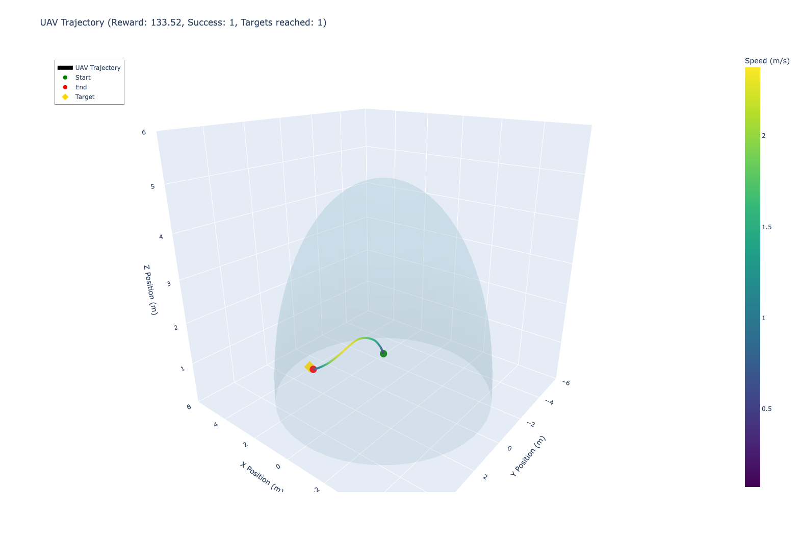
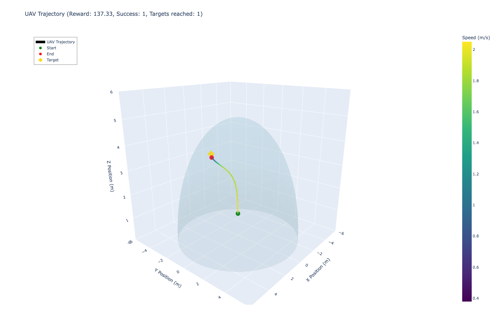

# uav-nav-obstacle-avoidance-rl

A Reinforcement Learning-based UAV navigation system for obstacle avoidance in dynamic environments.

### Examples
Some interim examples:
<video src="reports/examples/ep0-step-0-to-step-1000.mp4" width="480" controls></video>

UAV hovering around target to collect rewards!:
<video src="reports/examples/ep3-step-0-to-step-1000.mp4" width="480" controls></video>

## Project Organization

...

--------

